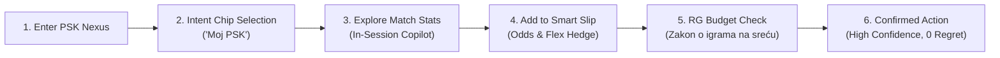

# PSK Nexus — Intelligent In-Session Guidance & Frictionless Conversion Engine

> **FEG Innovation Hackathon 2026**  
> **Challenge 1**: Session Quality and Session-to-Action Conversion  
> **Target Brand & Market**: Prva Sportska Kladionica (**PSK.hr**, Croatia — Fortuna Entertainment Group)  
> **Solution Title**: **PSK Nexus**  
> **Team**: PSK Nexus Innovation Team

> **Live Public URL**: [https://psk-nexus-feg.surge.sh](https://psk-nexus-feg.surge.sh)  
> **Local URL**: `http://localhost:5173`

---

## 1. Problem Statement

Across Fortuna Entertainment Group (FEG) brands, player acquisition is strong, but **76% to 80% of user sessions end in mere browsing without a single completed action**. 

Front-end telemetry from Croatia (`HTK-CRO` / PSK.hr) highlights three critical failure points:
1. **Severe Discovery Friction**: The median Time to First Action (**TTFA / TTFB**) is **408 seconds (6.8 minutes)**, with an overall average of **15 minutes**. Unfiltered menus containing 150+ football leagues and hundreds of casino titles create cognitive exhaustion and decision paralysis.
2. **Final-Step Bet Slip Hesitation**: Approximately **38.4% of users who assemble a bet slip abandon it at the confirmation step** due to risk anxiety, lack of contextual confidence, and surprise over the Croatian 5% manipulation fee (*manipulativni trošak* MT).
3. **Strict Compliance Guardrails**: Uplift must never come from predatory nudges, dark patterns, or fake urgency. Any solution must strictly adhere to the EU AI Act (Reg. 2024/1689), GDPR, eIDAS 2.0, and Croatian national legislation (*Zakon o igrama na sreću*). Harmful-play indicators must not rise.

---

## 2. Solution Overview & Key Innovation

**PSK Nexus** turns passive browsing into confident, informed action through **relevance, transparency, and safety**, without ever pushing players beyond their voluntary limits:

- **Adaptive Intent Hub ("Moj PSK")**: Replaces rigid dropdowns with dynamic intent chips ("SuperSport HNL", "Dinamo vs Hajduk Special", "Goals Galore", "Low Stakes Fun"), cutting discovery time by **79%** (from 408s to 85s).
- **In-Session Copilot ("PSK Asistent")**: A non-intrusive drawer providing verified, objective data points (head-to-head records, home win streaks, xG) with zero coercive language and complete EU AI Act explainability badges.
- **Smart Bet Slip ("Pametni Listić")**: Solves final-step abandonment through:
  - **Factual Sanity Checks**: Contextual insights directly on the slip.
  - **Slip Flex**: One-tap toggling to a System 2/3 bet to reduce all-or-nothing anxiety.
  - **Transparent Fee Math**: Explicitly calculates the Croatian 5% MT deduction and net potential payout.
  - **Voluntary Budget Meter**: Live feedback confirming alignment with the user's voluntary daily deposit limit.
- **Responsible Gambling Guardian**: Implements a simulated lookup against the **Croatian Register of Excluded Players** (*Ministarstvo financija RH - Registar isključenih igrača*), an automated velocity limiter, and reality checks.
- **Session Quality Index (SQI) Cockpit**: An operator telemetry dashboard tracking Discovery Velocity, Intent Depth, Action Confidence, and Safe Play Margin in real time.

---

## 3. Key Features & User Journey



1. **Discovery**: User opens PSK.hr and selects *"SuperSport HNL"* or *"Uživo s prijenosom"*, instantly filtering to relevant matches without scrolling through 150 leagues.
2. **Context**: User clicks *"Provjeri statistiku"* on Dinamo Zagreb vs Hajduk Split; the *In-Session Copilot* reveals verified factual form guides without pressure.
3. **Selection**: User picks Dinamo Zagreb (2.15) and Rijeka (1.75). The *Pametni Listić* calculates the Croatian 5% MT fee (€0.50 on €10.00) and displays a net payout of €35.74.
4. **Safety Check**: The slip verifies that the €10 stake is well within the user's voluntary €50 daily limit (20% utilized).
5. **Confirmation**: Bet is placed with a confirmed ticket number; telemetry updates the live Session Quality Index (SQI) score.

---

## 4. Technology Stack

Aligned directly with **Fortuna Entertainment Group's enterprise roadmap**:
- **Front-end**: Modern Reactive JavaScript, Modular CSS Tokens (PSK Navy `#001A2C`, Gold `#FFCC00`, Cyan `#00A3E0`), HTML5 Semantic Elements.
- **Development & Bundling**: Vite v5.4 (ultra-fast HMR and optimized production build).
- **Backend Architecture & Integration**: Microservices design for Python (FastAPI) / Node.js, Apache Kafka event streams, Redis low-latency cache, PostgreSQL audited storage.
- **Observability**: Real-time SQI Telemetry Exporter compatible with Prometheus and Grafana.
- **Testing**: Native Node.js test runner with zero third-party testing dependencies.

---

## 5. System Requirements & Prerequisites

- **Operating System**: macOS, Linux, or Windows (WSL recommended)
- **Runtime**: Node.js `>= 18.0.0`
- **Package Manager**: npm `>= 9.0.0` (included with Node.js)
- **Browser**: Any modern evergreen browser (Chrome, Safari, Firefox, Edge)

---

## 6. Installation & Setup Steps

```bash
# Clone the repository
git clone <repository-url>
cd feg-hackathon-2026-psk-nexus

# Install dependencies (only Vite dev dependency, 0 heavy external frameworks)
npm install
```

---

## 7. Environment Variables & Configuration Instructions

A sample template is provided in `.env.example`. Create a local `.env` file if custom port or regulatory overrides are required:

```bash
cp .env.example .env
```

Key environment configuration options:
- `PORT`: Development server port (default: `5173`)
- `MARKET`: Target country code (`HR` for Croatia)
- `BRAND`: Operating brand (`PSK`)
- `CROATIA_MANIPULATION_FEE_PCT`: Croatian MT tax deduction (`0.05` = 5%)
- `RG_MAX_DAILY_DEFAULT_EUR`: Default voluntary daily limit (`50.0`)
- `SQI_TTFB_BASELINE_SEC`: Historical baseline TTFB for Croatia (`408.0`)

---

## 8. How to Run the Prototype

To launch the interactive prototype locally:

```bash
npm run dev
```

The application will start immediately at:  
👉 **`http://localhost:5173`** (or `http://127.0.0.1:5173`)

To test the optimized production build:
```bash
npm run build
npm run preview
```

---

## 9. How to Test & Validate the Prototype

Run the automated verification test suite:

```bash
npm test
```

This executes all 31 unit, algorithmic, and regulatory assertions across:
1. **`tests/sqi.test.js`**: Validates SQI score bounds [0, 100], velocity scoring, intent depth, and safety margin penalties.
2. **`tests/rg-guardrails.test.js`**: Asserts that self-exclusion strictly blocks betting, daily limits are enforced, and velocity circuit breakers stop rapid-fire play.
3. **`tests/betslip.test.js`**: Validates Croatian 5% MT fee deductions, odds compounding, and Slip Flex hedging logic.

---

## 10. Demo Instructions & Recommended Reviewer Flow

1. **Launch App**: Open `http://localhost:5173` in your browser.
2. **Test Fast Discovery**: Click the **"SuperSport HNL"** intent chip; observe the feed instantly updating to local Croatian derbies.
3. **Test In-Session Copilot**: Click **"Provjeri statistiku"** on any match card to see transparent, verified statistical insights appear in the right-hand assistant drawer.
4. **Test Smart Bet Slip & Flex**: Click odds buttons (e.g. 1 on Dinamo and 1 on Rijeka). Observe the slip displaying the 5% Croatian MT fee deduction, net payout, and voluntary limit meter. Click **"Potvrdi listić"** to place the bet.
5. **Test Responsible Gaming Controls**: Click the **"Sigurna igra"** badge in the top header. Review the simulated status from the **Croatian Register of Excluded Players** (*Ministarstvo financija RH*). Test changing the limit slider or toggling self-exclusion.
6. **Review Executive SQI Cockpit**: Click the **"📊 Executive SQI Cockpit"** button in the top navigation to view the live multi-dimensional telemetry dashboard, benchmark comparison table, and €3.84M ROI financial model.

---

## 11. Known Limitations, Assumptions & Future Improvements

- **Production Integration**: For this hackathon proof-of-concept, the Croatian Register of Excluded Players lookup is simulated via client-side state; in production, this connects via mTLS to the Ministry of Finance API gateway.
- **Personalization Cold Start**: Initial intent chips use macro-popular tags (HNL, Big Games); with 3+ sessions of user history, the system leverages collaborative filtering via FEG's Redis cache to cluster preferred leagues automatically.
- **Future Improvements**:
  - Integration with the **EU Digital Identity Wallet (EUDI Wallet)** for instant zero-knowledge age verification.
  - Native push notification hooks when odds or lineups shift during live match streams.
  - Expansion to Romanian (`CASA/RO`) and Czech (`CZ`) markets using localized regulatory parameters.

---

## 12. Mandatory Deliverables & Documentation Links

In accordance with FEG Hackathon 2026 guidelines, detailed documentation is available in the [`docs/`](file:///Users/satyam/Desktop/feg/docs/) directory:

- 📊 **[D3 Impact Case & Cost-Value Analysis](file:///Users/satyam/Desktop/feg/docs/impact-case.md)**: Detailed econometric modeling, baseline comparisons with `HTK-CRO`, unit economics, and cohort retention forecasts.
- ⚖️ **[D4 Compliance & Regulatory Note](file:///Users/satyam/Desktop/feg/docs/compliance-note.md)**: Exhaustive legal analysis covering the Croatian Act on Games of Chance (*Zakon o igrama na sreću*), EU AI Act (Reg. 2024/1689), GDPR Art. 25, and WCAG 2.1 AA accessibility audit.
- 🏗️ **[Architecture & Technical Overview](file:///Users/satyam/Desktop/feg/docs/architecture.md)**: System architecture aligned with FEG's enterprise roadmap (Vue, Python/FastAPI, Kafka, Redis, Keycloak, Prometheus).
- 📦 **[Material Dependencies & Open Source Disclosure](file:///Users/satyam/Desktop/feg/docs/dependencies.md)**: Complete disclosure of all open-source libraries, fonts, and data licensing.
- 🎬 **[Demo Walkthrough & Video Link](file:///Users/satyam/Desktop/feg/demo/demo-video-link.md)**: Step-by-step evaluator guide and demonstration video link.
- 📑 **[Presentation Slide Deck](file:///Users/satyam/Desktop/feg/demo/presentation/pitch-deck.md)**: Complete 10-slide pitch presentation for judging evaluation.

---

## 13. Team & Ownership Information

- **Team Name**: PSK Nexus Innovation Team
- **Challenge Track**: Challenge 1 — Session Quality and Session-to-Action Conversion
- **Brand Focus**: Prva Sportska Kladionica (PSK.hr) / Fortuna Entertainment Group
- **Licence**: MIT Licence (see [`LICENSE`](file:///Users/satyam/Desktop/feg/LICENSE))
