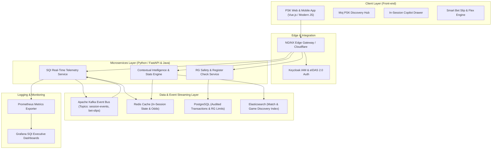
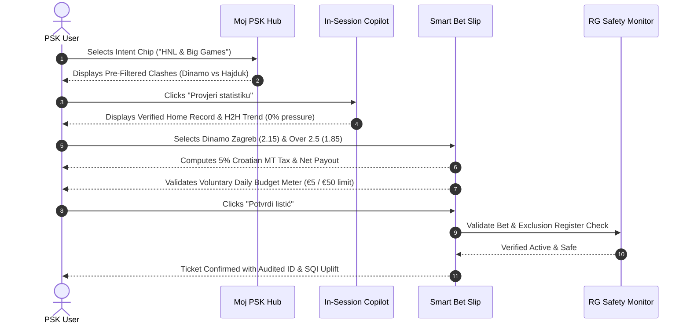

# Architecture & Technical Overview
**Challenge 1: Session Quality and Session-to-Action Conversion**  
**Brand & Market**: Prva Sportska Kladionica (**PSK.hr**, Croatia — Fortuna Entertainment Group)  
**Solution**: **PSK Nexus**  
**Submission**: FEG Innovation Hackathon 2026

---

## 1. System Overview & FEG Enterprise Stack Alignment

`PSK Nexus` is architected to integrate seamlessly with **Fortuna Entertainment Group’s (FEG)** approved enterprise technology landscape, avoiding legacy/deprecated patterns (such as PHP, Velocity Templates, MS SQL, or Hyper-V) and aligning directly with modern microservices and event-driven backbones.

### FEG Technology Mapping

---

## 2. Component Specifications

### 2.1 Front-End Layer (`src/`)
- **Technology**: Modular JavaScript / Vue-compatible reactive components built on standard CSS variables and semantic HTML5.
- **Components**:
  - `DiscoveryHub.js`: Contextual intent filtering ("Moj PSK"), pre-clustering sports matches and casino games into intent vectors.
  - `InSessionCopilot.js`: Non-intrusive drawer rendering verified factual insights with explicit AI Act transparency notices.
  - `SmartBetSlip.js`: Reactive slip calculator managing gross stake, 5% Croatian MT deduction, net stake, and system flex hedges.
  - `RGGuardianModal.js`: Voluntary limit controller and Croatian Ministry of Finance Exclusion Register validator.
  - `SQICockpit.js`: Executive monitoring view for live telemetry and business impact projections.

### 2.2 Telemetry & Real-Time SQI Engine (`src/services/sqiEngine.js`)
The Session Quality Index (SQI) computes a normalized multi-dimensional score:
$$SQI = 0.25 \times V_{\text{velocity}} + 0.25 \times D_{\text{intent}} + 0.25 \times C_{\text{action}} + 0.25 \times S_{\text{safety}}$$

- **Discovery Velocity ($V_{\text{velocity}}$)**: Tracks milliseconds to first meaningful user action against the historical benchmark (408 seconds).
- **Intent Depth ($D_{\text{intent}}$)**: Quantifies purposeful engagement (filtering, inspecting head-to-head records) versus aimless bouncing.
- **Action Confidence ($C_{\text{action}}$)**: Evaluates final-step conversion, rewarding system hedging and low-hesitation confirmations.
- **Safety Margin ($S_{\text{safety}}$)**: Evaluates session pacing, deducting points if betting velocity exceeds 4 bets/min or approaches daily limits.

### 2.3 Responsible Gaming Circuit Breaker (`src/services/rgSafetyMonitor.js`)
- **Croatian Register Simulation**: Simulates direct lookup against the Ministry of Finance Register (*Registar isključenih igrača*).
- **Velocity Limiter**: Maintains a sliding window of bet timestamps over 60 seconds. Rapid-fire placement automatically interrupts the flow with a reality pause.
- **Limit Enforcement**: Strictly rejects slip confirmation if the proposed stake exceeds the user's voluntary remaining budget.

---

## 3. Data Flows & Sequence Workflows

### 3.1 Frictionless Discovery & In-Session Guidance Flow

---

## 4. Latency Budgets & Non-Functional Requirements

| Pipeline Step | Target Latency | P99 SLA | Mechanism |
| :--- | :--- | :--- | :--- |
| **Intent Chip Filter Filtering** | $< 15\text{ ms}$ | $< 50\text{ ms}$ | In-memory index / Redis pre-aggregated feeds |
| **In-Session Copilot Insight Fetch** | $< 35\text{ ms}$ | $< 80\text{ ms}$ | Pre-computed Opta/HNL facts cached in Redis |
| **Smart Bet Slip Calculation** | $< 5\text{ ms}$ | $< 10\text{ ms}$ | Client-side reactive math |
| **Register Check & RG Validation** | $< 40\text{ ms}$ | $< 100\text{ ms}$ | Local replicated cache of national register hashes |

---

## 5. Security & Deployment Architecture

1. **Confidentiality & Zero-Data Leakage**:
   - Strictly no real customer personal identifiable information (PII) or banking credentials are ingested or logged.
   - All environment credentials and secrets are managed via `.env` (excluded via `.gitignore`).
2. **Containerization & Cloud Infrastructure**:
   - Ready for packaging into lightweight Docker container images running on FEG's **Red Hat OpenShift** or **AWS ECS/EKS** clusters.
   - Microservices communicate over TLS 1.3 with mTLS for internal service-to-service communication.
